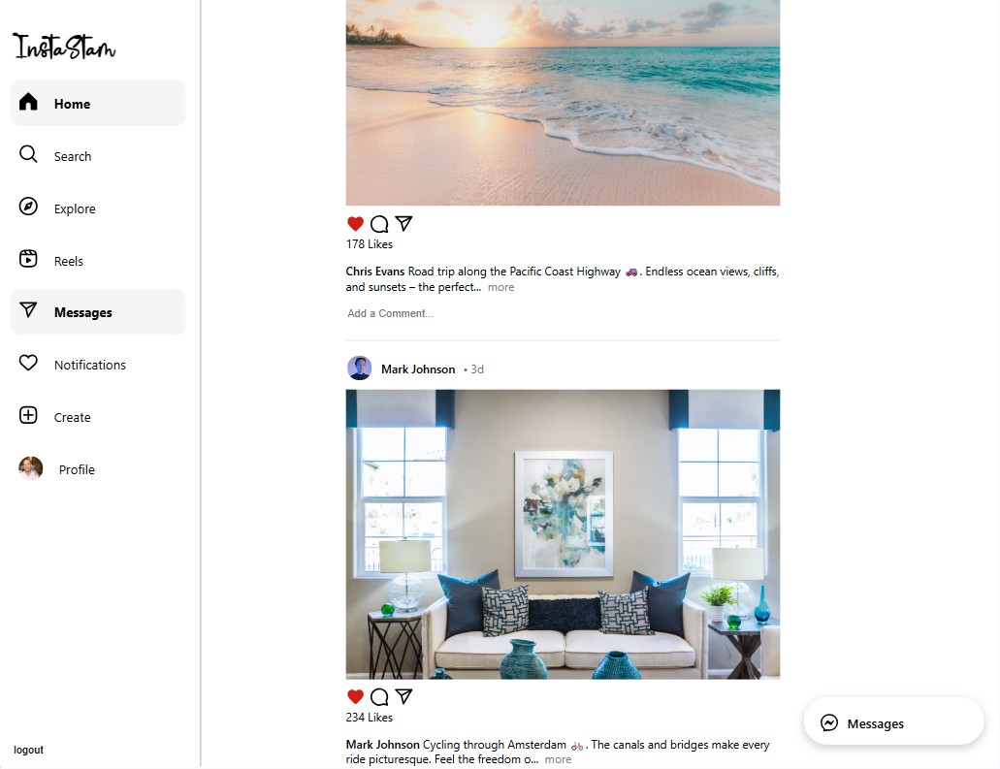
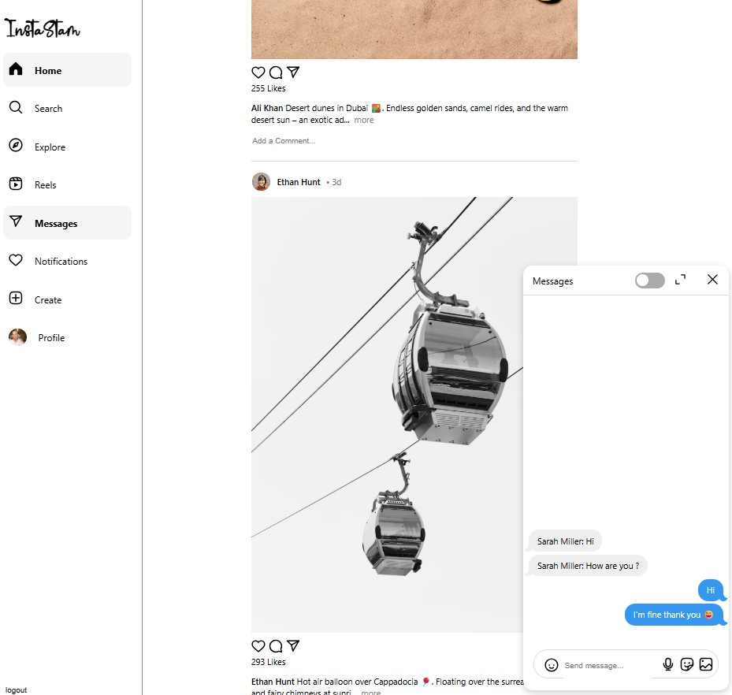
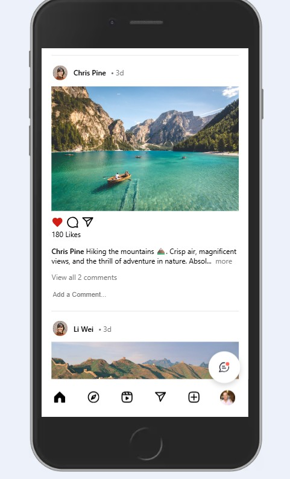

# 📸 InstaStam


**InstaStam** is a fullstack social media application inspired by Instagram – featuring posts, stories, likes, comments, chat and notifications in real-time.  
It combines a **React + Redux frontend** with a **Node.js/Express backend**, and offers **real-time interactions** powered by **Socket.io**.

---

## 🌍 Live Demo
👉 [InstaStam on Render](https://instastam.onrender.com/story)

🔗 [Frontend Repository](https://github.com/Ridan77/instgram_frontend)  
🔗 [Backend Repository](https://github.com/Ridan77/instagram_backend)

---

## 📸 Screenshots

| Feed (Web) | Profile (Web) |
|------------|---------------|
|  |  |

| Group Chat (Web) | Mobile View |
|------------------|-------------|
|  |  |

---

## 🚀 Tech Stack

### Frontend
- **React 18** (with Hooks)
- **Redux** (state management)
- **React Router** (routing)
- **SCSS Modules** (styling)
- **Vite** (build tool)
- **Axios** (HTTP client)
- **Socket.io-client** (real-time updates)
- **React Dropzone** (drag & drop file upload)
- **Emoji Picker React** (emoji support)
- **Jest** / **React Testing Library** (testing)

### Backend
- **Node.js** & **Express.js**
- **MongoDB** (with Mongoose ODM)
- **Socket.io** (real-time communication)
- **JWT** (authentication)
- **bcrypt** (password hashing)
- **Cloudinary** (image uploads)
- **CORS**, **dotenv**, **morgan** (middleware & utilities)

### Deployment & Utilities
- **Render** (deployment)
- **Cloudinary** (image hosting)

---

## ✨ Features

**Authentication & Profiles**  
- Sign up, log in, JWT-based sessions  
- View profiles, followers, following  

**Posts & Stories**  
- Create, edit, and delete posts with image upload  
- Infinite scroll feed  
- Explore page for trending users and stories  
- Like/unlike posts and follow/unfollow users  

**Real-time Interactions**  
- Group chat with multiple users (Socket.io)  
- Real-time notifications for likes, comments, follows, messages  
- Emoji support in posts, comments, and chat  
- Drag & drop image upload  

**UI/UX**  
- Pixel-perfect, mobile-first responsive design  

---

## 🗂️ Project Structure

```plaintext
instaStam/
├── backend/
│   ├── api/           # Express route handlers (auth, user, story, comment, chat)
│   ├── models/        # Mongoose schemas
│   ├── services/      # Business logic
│   ├── sockets/       # Socket.io setup (chat, notifications)
│   ├── config/        # DB, env, and middleware config
│   └── app.js         # Express app entry point
│
├── frontend/
│   ├── public/
│   │   └── screenshots/  # Feed, Profile, Chat, Mobile images
│   ├── src/
│   │   ├── assets/       
│   │   ├── cmps/        
│   │   ├── pages/       
│   │   ├── services/    
│   │   ├── store/       
│   │   └── App.jsx      
│   └── vite.config.js
│
├── README.md
└── package.json


Distributed under the MIT License. 

Built with ❤️ by Dan Ribak as a final project at Coding Academy.